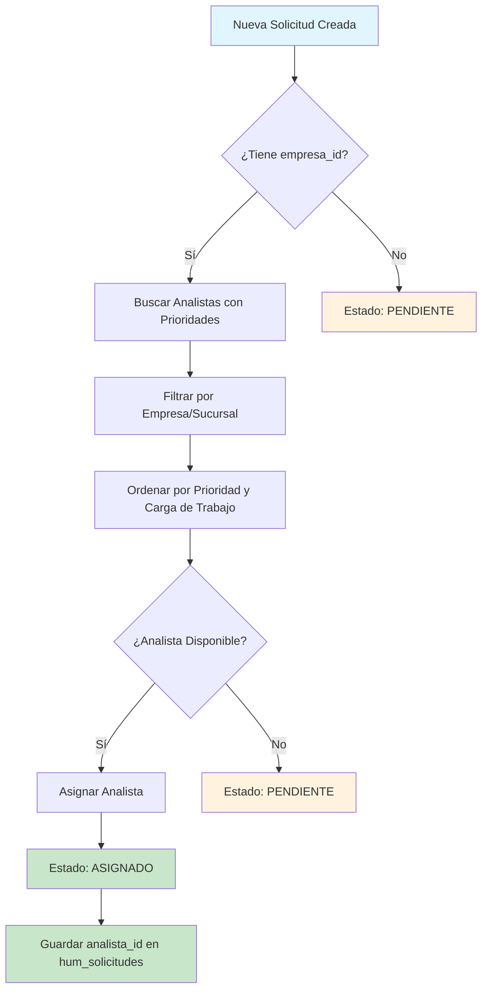
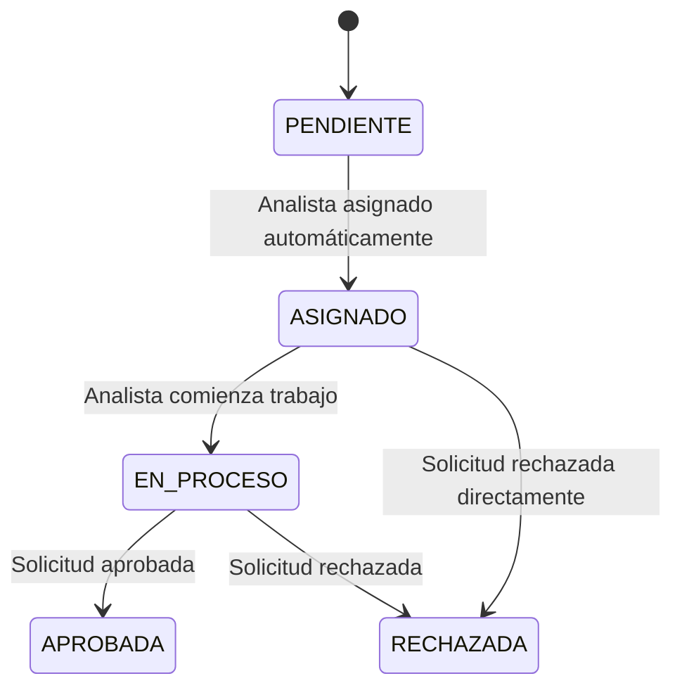

# Sistema de Asignación Automática de Analistas

## Descripción General

El sistema de asignación automática de analistas permite que las solicitudes se asignen automáticamente a los analistas disponibles basándose en un sistema de prioridades configurado. Esto asegura una distribución equitativa de la carga de trabajo y optimiza el tiempo de respuesta.

## Arquitectura del Sistema

### 1. Tabla `analista_prioridades`

Esta tabla almacena la configuración de prioridades para cada analista:

```sql
CREATE TABLE analista_prioridades (
  id SERIAL PRIMARY KEY,
  usuario_id INTEGER REFERENCES gen_usuarios(id),
  empresa_id INTEGER REFERENCES empresas(id),
  sucursal_id INTEGER REFERENCES gen_sucursales(id),
  nivel_prioridad_1 VARCHAR(50), -- 'empresa', 'sucursal', 'solicitudes'
  nivel_prioridad_2 VARCHAR(50),
  nivel_prioridad_3 VARCHAR(50),
  cantidad_solicitudes INTEGER DEFAULT 0,
  created_at TIMESTAMP DEFAULT NOW(),
  updated_at TIMESTAMP DEFAULT NOW()
);
```

### 2. Tabla `hum_solicitudes` (Actualizada)

Se agregó el campo `analista_id` para almacenar el analista asignado:

```sql
-- Agregar campo analista_id (permitir NULL para solicitudes sin asignar)
ALTER TABLE hum_solicitudes ADD COLUMN analista_id INTEGER NULL;

-- Crear índices para optimizar consultas
CREATE INDEX idx_hum_solicitudes_analista_id ON hum_solicitudes(analista_id);
CREATE INDEX idx_hum_solicitudes_empresa_analista ON hum_solicitudes(empresa_id, analista_id);
```

**Nota importante**: No se crean foreign key constraints estrictos para permitir:
- Solicitudes sin analista asignado (`analista_id = NULL`)
- Flexibilidad en la asignación manual
- Evitar errores de integridad referencial

## Lógica de Asignación

### Prioridades por Nivel

1. **Prioridad 1 (Alta)**: Analistas especializados en empresas o sucursales específicas
2. **Prioridad 2 (Media)**: Analistas con experiencia intermedia
3. **Prioridad 3 (Baja)**: Analistas generales o de respaldo

### Tipos de Prioridad

- **`empresa`**: El analista se especializa en una empresa específica
- **`sucursal`**: El analista se especializa en una sucursal específica
- **`solicitudes`**: El analista puede manejar cualquier tipo de solicitud

### Algoritmo de Selección

1. **Filtrado por Elegibilidad**: Se filtran analistas que tengan prioridades configuradas para la empresa/sucursal de la solicitud
2. **Ordenamiento por Prioridad**: Se ordenan por nivel de prioridad (1 > 2 > 3)
3. **Balanceo de Carga**: Entre analistas del mismo nivel, se selecciona el que tenga menos solicitudes asignadas
4. **Asignación**: Se asigna la solicitud al mejor analista disponible

## 🔄 **Flujo de Asignación Automática**



### **📊 Conteo de Solicitudes Asignadas**

**IMPORTANTE**: El sistema ahora cuenta las solicitudes reales asignadas desde la tabla `hum_solicitudes` en lugar de mantener un contador manual en `analista_prioridades`.

- **Antes**: Se usaba el campo `cantidad_solicitudes` de `analista_prioridades` que se incrementaba manualmente
- **Ahora**: Se hace un conteo real con `SELECT COUNT(*) FROM hum_solicitudes WHERE analista_id = ?`
- **Ventaja**: Los números mostrados siempre reflejan la realidad actual de las solicitudes asignadas

## Estados de las Solicitudes

### Flujo de Estados Automático

1. **PENDIENTE**: Solicitud creada sin analista asignado
   - Ocurre cuando no hay analistas disponibles
   - Ocurre cuando la solicitud no tiene `empresa_id`

2. **ASIGNADO**: Solicitud con analista asignado automáticamente
   - Ocurre cuando se asigna exitosamente un analista
   - Estado intermedio antes de que el analista comience el trabajo

3. **EN_PROCESO**: Solicitud siendo procesada por el analista
   - Estado manual que se puede cambiar desde la interfaz

4. **APROBADA**: Solicitud aprobada por el analista
   - Estado final exitoso

5. **RECHAZADA**: Solicitud rechazada por el analista
   - Estado final no exitoso

### Transiciones de Estado



### **🔧 Servicios Implementados**

#### **1. `analistaAsignacionService`**
- **`asignarAnalistaAutomatico(empresaId, sucursalId?)`**: Función principal que asigna automáticamente un analista
- **`getAnalistaAsignado(solicitudId)`**: Obtiene información del analista asignado a una solicitud
- **NOTA**: El método `actualizarCantidadSolicitudes` ya no se usa, ya que ahora se cuentan las solicitudes reales

#### **2. `solicitudesService`**
- **`create()`**: Crea solicitudes con asignación automática de analista
- **`createWithTemplate()`**: Crea solicitudes desde plantillas con asignación automática
- **Ambos métodos**: Cambian automáticamente el estado a "ASIGNADO" si se asigna un analista

**Nota técnica**: Los métodos de consulta usan joins manuales en lugar de la sintaxis de relación automática de Supabase para evitar errores de foreign key.

**Cambio de Estado Automático**: Cuando se asigna un analista automáticamente, el estado cambia de PENDIENTE a ASIGNADO.

## Uso en el Frontend

### Lista de Solicitudes

La tabla de solicitudes ahora incluye una columna "Analista Asignado" que muestra:
- Nombre del analista asignado
- Email del analista
- "Sin asignar" si no hay analista asignado

### Creación de Solicitudes

Al crear una nueva solicitud:
1. Se valida que tenga `empresa_id`
2. Se ejecuta la asignación automática
3. Se crea la solicitud con el `analista_id` asignado
4. Se actualiza el contador de solicitudes del analista

## Configuración de Prioridades

### Ejemplo de Configuración

```typescript
// Analista especializado en empresa específica
{
  usuario_id: 123,
  empresa_id: 456,
  nivel_prioridad_1: 'empresa',
  nivel_prioridad_2: 'solicitudes',
  nivel_prioridad_3: null
}

// Analista general
{
  usuario_id: 789,
  empresa_id: null,
  nivel_prioridad_1: 'solicitudes',
  nivel_prioridad_2: null,
  nivel_prioridad_3: null
}
```

## Ventajas del Sistema

1. **Distribución Automática**: No requiere intervención manual
2. **Balanceo de Carga**: Distribuye trabajo equitativamente
3. **Especialización**: Respeta las áreas de expertise de cada analista
4. **Escalabilidad**: Fácil de configurar para nuevos analistas
5. **Trazabilidad**: Registra qué analista maneja cada solicitud
6. **Flexibilidad**: Permite solicitudes sin analista asignado

## Consideraciones de Implementación

### Base de Datos

- Ejecutar la migración SQL para agregar `analista_id`
- Crear índices para optimizar consultas
- **NO se crean foreign key constraints** para mantener flexibilidad
- El campo `analista_id` permite valores NULL

### Performance

- El sistema consulta todas las prioridades al crear solicitudes
- Para sistemas con muchos analistas, considerar cache de prioridades
- Los índices en `analista_id` mejoran el rendimiento de consultas
- Los joins manuales son más eficientes que las relaciones automáticas

### Monitoreo

- Logs detallados en consola para debugging
- Métricas de asignación automática vs. manual
- Alertas si no hay analistas disponibles
- Script de prueba incluido para verificar funcionamiento

## Script de Prueba

Se incluye un script de prueba completo en `scripts/test_asignacion_analistas.js` que:

1. ✅ Verifica la estructura de la base de datos
2. ✅ Comprueba la existencia de analistas con prioridades
3. ✅ Valida la creación de solicitudes con asignación automática
4. ✅ Verifica la asignación correcta de analistas
5. ✅ Limpia los datos de prueba

### Ejecutar Pruebas

```bash
# Configurar variables de entorno
export SUPABASE_URL="tu_url_de_supabase"
export SUPABASE_ANON_KEY="tu_clave_anonima"

# Ejecutar script de prueba
node scripts/test_asignacion_analistas.js
```

## Próximas Mejoras

1. **Reasignación Automática**: Cambiar analista si está sobrecargado
2. **Notificaciones**: Alertar a analistas sobre nuevas asignaciones
3. **Métricas Avanzadas**: Dashboard de carga de trabajo por analista
4. **Configuración de Horarios**: Considerar disponibilidad temporal
5. **Fallback Automático**: Reasignar solicitudes si el analista no responde
6. **Cache de Prioridades**: Optimizar consultas para sistemas grandes

## Ejemplos de Uso

### Caso 1: Solicitud con Analista Asignado Automáticamente

```typescript
// Crear solicitud con empresa_id
const nuevaSolicitud = await solicitudesService.create({
  empresa_id: 123,
  estado: 'PENDIENTE', // Estado inicial
  nombres: 'Juan',
  apellidos: 'Pérez',
  cargo: 'Desarrollador'
});

// Resultado:
// - analista_id: 456 (asignado automáticamente)
// - estado: 'ASIGNADO' (cambiado automáticamente)
// - analista: { id: 456, nombre: 'Ana García', email: 'ana@empresa.com' }
```

### Caso 2: Solicitud sin Analista Disponible

```typescript
// Crear solicitud cuando no hay analistas disponibles
const solicitudSinAnalista = await solicitudesService.create({
  empresa_id: 789,
  estado: 'PENDIENTE',
  nombres: 'María',
  apellidos: 'López',
  cargo: 'Diseñador'
});

// Resultado:
// - analista_id: null
// - estado: 'PENDIENTE' (se mantiene)
// - analista: undefined
```

### Caso 3: Solicitud con Analista Pre-asignado

```typescript
// Crear solicitud con analista ya especificado
const solicitudConAnalista = await solicitudesService.create({
  empresa_id: 123,
  analista_id: 999, // Analista ya especificado
  estado: 'PENDIENTE',
  nombres: 'Carlos',
  apellidos: 'Rodríguez',
  cargo: 'Analista'
});

// Resultado:
// - analista_id: 999 (se mantiene)
// - estado: 'PENDIENTE' (no cambia porque ya tenía analista)
// - analista: { id: 999, nombre: 'Pedro Sánchez', email: 'pedro@empresa.com' }
```

## Casos de Prueba

### Prueba 1: Asignación Automática Exitosa
1. **Precondición**: Existen analistas con prioridades configuradas para la empresa
2. **Acción**: Crear solicitud con `empresa_id`
3. **Resultado Esperado**: 
   - `analista_id` se asigna automáticamente
   - `estado` cambia a "ASIGNADO"
   - Se actualiza contador de solicitudes del analista

### Prueba 2: Sin Analistas Disponibles
1. **Precondición**: No hay analistas con prioridades para la empresa
2. **Acción**: Crear solicitud con `empresa_id`
3. **Resultado Esperado**:
   - `analista_id` permanece como `null`
   - `estado` se mantiene como "PENDIENTE"
   - Se registra log de advertencia

### Prueba 3: Solicitud sin Empresa
1. **Precondición**: Solicitud sin `empresa_id`
2. **Acción**: Crear solicitud
3. **Resultado Esperado**:
   - No se ejecuta asignación automática
   - `estado` se mantiene como se especificó
   - Se registra log informativo

## Monitoreo y Logs

### Logs de Asignación Automática

```bash
🔍 Creando solicitud con asignación automática de analista...
🔄 Asignando analista automáticamente...
✅ Analista asignado automáticamente: Ana García
🔄 Estado de solicitud cambiado a: ASIGNADO
📝 Datos de la solicitud a crear: { empresa_id: 123, analista_id: 456, estado: 'ASIGNADO', ... }
✅ Solicitud creada exitosamente con analista: Ana García
📊 Estado final de la solicitud: ASIGNADO
```

### Logs de Fallo en Asignación

```bash
🔍 Creando solicitud con asignación automática de analista...
🔄 Asignando analista automáticamente...
⚠️ No se pudo asignar analista automáticamente
📝 Datos de la solicitud a crear: { empresa_id: 123, analista_id: null, estado: 'PENDIENTE', ... }
✅ Solicitud creada exitosamente con analista: Sin asignar
📊 Estado final de la solicitud: PENDIENTE
```
