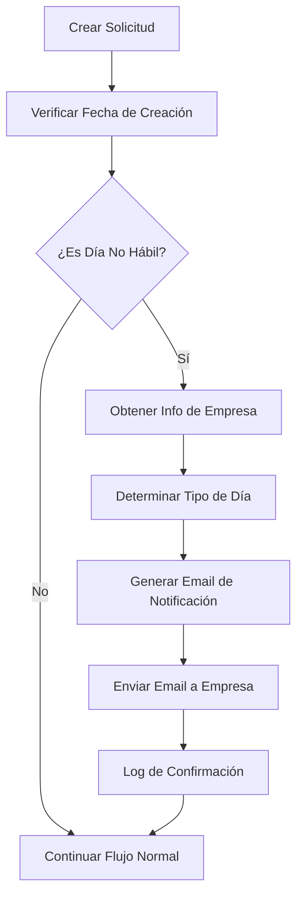

# Notificación de Solicitudes Creadas en Días No Hábiles

## Descripción

Esta funcionalidad implementa un sistema de notificación automática que envía un email a la empresa cliente cuando se crea una solicitud en días no hábiles (sábados, domingos o días festivos en Colombia).

## Características

### 1. Detección de Días No Hábiles

- **Sábados y Domingos**: Detecta automáticamente los fines de semana
- **Días Festivos de Colombia**: Incluye todos los festivos oficiales del país:
  - Año Nuevo (1 de enero)
  - Día del Trabajo (1 de mayo)
  - Independencia de Colombia (20 de julio)
  - Batalla de Boyacá (7 de agosto)
  - Inmaculada Concepción (8 de diciembre)
  - Navidad (25 de diciembre)
  - Días festivos móviles basados en Semana Santa:
    - Jueves Santo
    - Viernes Santo
    - Ascensión del Señor
    - Corpus Christi
    - Sagrado Corazón de Jesús

### 2. Notificación Automática

Cuando se crea una solicitud en un día no hábil, el sistema:

1. **Detecta automáticamente** si la fecha de creación es un día no hábil
2. **Obtiene el email de la empresa** desde la tabla `empresas.email`
3. **Envía una notificación** informando sobre la creación en día no hábil
4. **Incluye información detallada** sobre el tipo de día y posibles impactos

### 3. Template de Email

El email incluye:

- **Información de la solicitud**: Número, empresa, fecha de creación
- **Tipo de día no hábil**: Sábado, Domingo, o nombre del festivo
- **Advertencias importantes**: Impacto en tiempos de procesamiento
- **Enlace al sistema**: Para revisar la solicitud
- **Diseño profesional**: Template HTML responsivo y atractivo

## Archivos Modificados

### 1. `client/src/services/holidaysService.ts` (Nuevo)
- Servicio para manejar días festivos de Colombia
- Algoritmo de cálculo de Pascua para festivos móviles
- Funciones de detección de días no hábiles

### 2. `client/src/services/emailService.ts`
- Nuevo método `sendSolicitudDiaNoHabil()`
- Template HTML `generateSolicitudDiaNoHabilHTML()`
- Integración con el sistema de envío de emails existente

### 3. `client/src/services/solicitudesService.ts`
- Integración de la lógica de detección en métodos `create()` y `createWithTemplate()`
- Envío automático de notificaciones a empresas
- Manejo de errores y logging

## Flujo de Funcionamiento



## Configuración

### Campos de Base de Datos Requeridos

La funcionalidad utiliza los siguientes campos de la tabla `empresas`:

- `email`: Email de la empresa para notificaciones
- `razon_social`: Nombre de la empresa para el email

### Variables de Entorno

No se requieren variables de entorno adicionales. Utiliza la configuración existente del sistema de emails.

## Ejemplos de Uso

### Caso 1: Solicitud en Sábado
```
Fecha: 2024-01-06 (Sábado)
Tipo: Sábado
Email enviado a: empresa@ejemplo.com
Asunto: "Notificación - Solicitud #123 creada en día no hábil"
```

### Caso 2: Solicitud en Festivo
```
Fecha: 2024-01-01 (Año Nuevo)
Tipo: Festivo (Año Nuevo)
Email enviado a: empresa@ejemplo.com
Asunto: "Notificación - Solicitud #124 creada en día no hábil"
```

## Logging y Monitoreo

El sistema incluye logging detallado:

- ✅ Confirmación de envío exitoso
- ⚠️ Advertencias cuando no se encuentra email de empresa
- ❌ Errores en el proceso de envío
- 📅 Información detallada sobre el tipo de día no hábil

## Consideraciones Técnicas

### Rendimiento
- La verificación de días festivos es eficiente (cálculo en memoria)
- El envío de emails es asíncrono y no bloquea la creación de solicitudes
- Manejo de errores robusto para evitar fallos en el flujo principal

### Escalabilidad
- El servicio de días festivos puede extenderse fácilmente para otros países
- El template de email es reutilizable para otros tipos de notificaciones
- La lógica está centralizada y es fácil de mantener

### Seguridad
- Validación de emails antes del envío
- Manejo seguro de errores sin exposición de información sensible
- Logging apropiado para auditoría

## Próximas Mejoras

1. **Configuración por Empresa**: Permitir que cada empresa configure si desea recibir estas notificaciones
2. **Horarios Personalizados**: Permitir definir horarios de trabajo por empresa
3. **Notificaciones Múltiples**: Enviar a múltiples contactos de la empresa
4. **Dashboard de Notificaciones**: Panel para ver el historial de notificaciones enviadas
5. **Templates Personalizables**: Permitir personalizar el contenido del email por empresa

## Soporte

Para reportar problemas o solicitar mejoras relacionadas con esta funcionalidad, contactar al equipo de desarrollo con la siguiente información:

- Fecha y hora de la solicitud
- ID de la solicitud
- Tipo de día no hábil detectado
- Email de destino
- Logs del sistema (si están disponibles)
